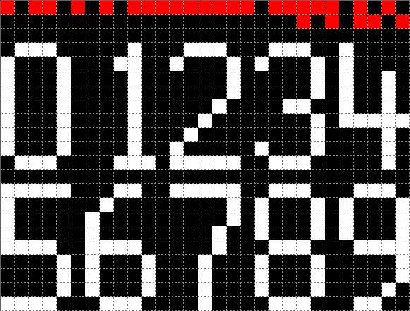
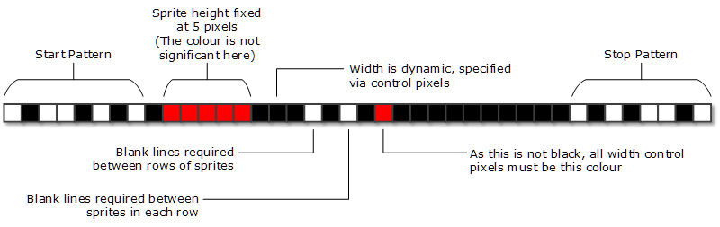
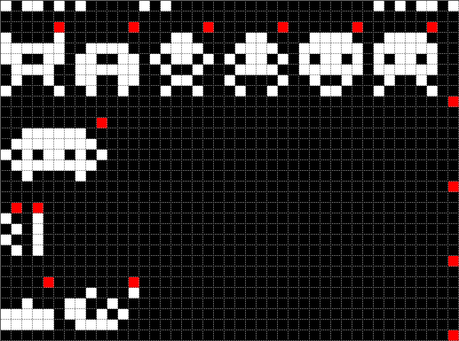
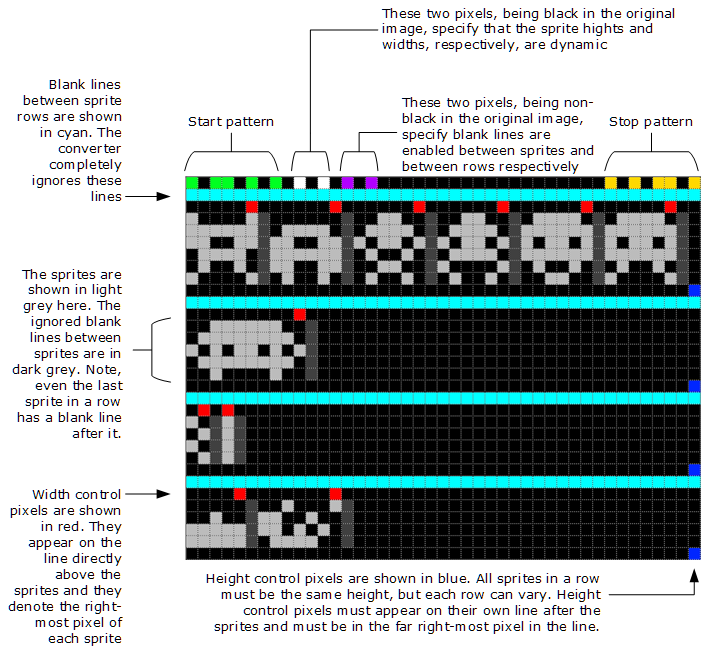

# spritesheet-to-python
Simple utility to generate python sprite bitmap modules from simple bitmap spritesheets.

## Basic use
Using a spritesheet that has the details of the sprites encoded in the first line, we can use the command:
```
sprites2py numbers_5x9.png numbers_5x9.py
```
with the following png:



to create the following python code:

```python
NUMBERS_5x9: list[list[int]] = [
    [ 0b01110, 0b10001, 0b10001, 0b10001, 0b10001, 0b10001, 0b10001, 0b10001, 0b01110 ],
    [ 0b00010, 0b00110, 0b00010, 0b00010, 0b00010, 0b00010, 0b00010, 0b00010, 0b00111 ],
    [ 0b01110, 0b10001, 0b00001, 0b00001, 0b00010, 0b00100, 0b01000, 0b10000, 0b11111 ],
    [ 0b01110, 0b10001, 0b00001, 0b00001, 0b00110, 0b00001, 0b00001, 0b10001, 0b01110 ],
    [ 0b10000, 0b10000, 0b10010, 0b10010, 0b10010, 0b11111, 0b00010, 0b00010, 0b00010 ],
    [ 0b11111, 0b10000, 0b10000, 0b10000, 0b11110, 0b00001, 0b00001, 0b00001, 0b11110 ],
    [ 0b00110, 0b01000, 0b10000, 0b10000, 0b11110, 0b10001, 0b10001, 0b10001, 0b01110 ],
    [ 0b11111, 0b00001, 0b00001, 0b00010, 0b00010, 0b00100, 0b00100, 0b00100, 0b00100 ],
    [ 0b01110, 0b10001, 0b10001, 0b10001, 0b01110, 0b10001, 0b10001, 0b10001, 0b01110 ],
    [ 0b01110, 0b10001, 0b10001, 0b10001, 0b01111, 0b00001, 0b00001, 0b00010, 0b01100 ]
]
```





## spritesheet structure
The spritesheet needs to be of a specific format to be correctly processed by this utility. The first line of the image is an information
line that instructs the utility in how to decode the rest of the spritesheet. It's format is of the form:
```
X.XX.X.X.hhh.www.v.b.c.X.X.XX.X
```
`X` - A white pixel in the start and stop patterns

`.` - A black pixel

`hhh` - If one or more non-black pixels long, the number of pixels specifies a fixed height for the sprites. If exactly one black pixel in length, then control pixels control the variable heights of individual sprites. Those control pixels appear directly below each sprite and must not appear in the blank line row if `v` is non-black (see below)

`www` - If one or more non-black pixels long, the number of pixels specifies a fixed width for the sprites. If exactly one black pixel in length, then control pixels control the variable widths of individual sprites. Control pixels must appear in their own column of pixels after each sprite.

`v` - vertical blank line control. If a non-black pixel, then a blank (all black) line is expected between each row of sprites
`b` - horizontal blank line control. If a non-black pixel, then a blank (all black) line is expected between each sprite within a row

`c` - strict mode pixel. If black, then there is no specific colour specified for control pixels and blank lines between sprites and rows - if enabled - are simply ignored. If not black, then all control pixels must be of this colour and all blank lines must contain just black pixels. The utility will report an error if this isn't the case. This adds an extra check that the utility is correctly processing the spritesheet.